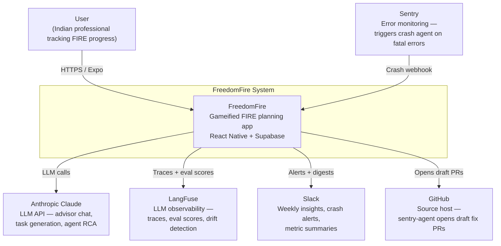
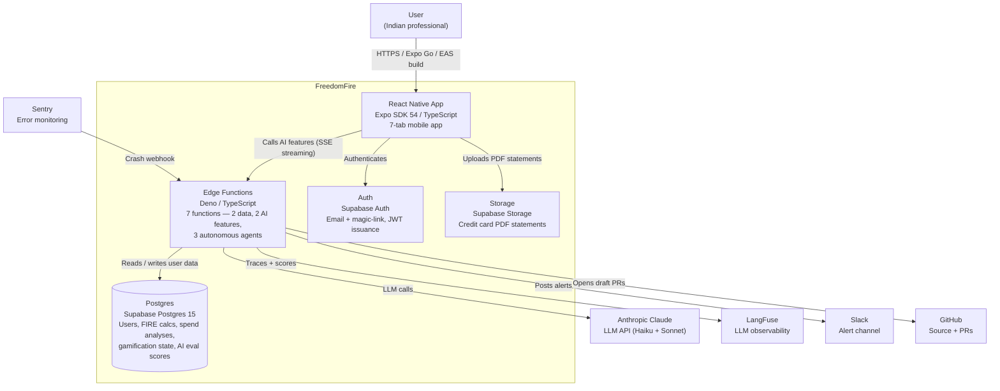

# FreedomFire

**Retire Early. Live Free.** — A gamified FIRE (Financial Independence, Retire Early) planning app for Indian users, built with React Native / Expo and Supabase.

---

## Demo

  

[View all screenshots →](docs/demo.md)

---

## What Is This?

Most retirement calculators are American-centric, joyless spreadsheets. FreedomFire is built specifically for India and designed to make saving money genuinely engaging.

**The core idea:** users enter their income, expenses, and savings; the app computes their exact FIRE number accounting for Indian inflation and EMIs, then gamifies the journey with XP, badges, streaks, and quests. As they improve their finances, they see the reward in concrete terms — *Freedom Days* gained rather than abstract rupee totals.

**What makes it different:**

- India-specific FIRE math (rupee-denominated, Indian inflation rates, EMI payoff timing)
- Full gamification loop (XP, 50 levels, 12 badges, streaks, quests, personalised tasks)
- AI advisor grounded in the user's actual numbers, not generic advice
- Three autonomous agents that run in the background handling weekly insights, crash triage, and metric anomaly detection — no human ops required

---

## Built AI-Natively

FreedomFire is "AI-native" in two distinct senses: AI is embedded in the product *and* in how the product was built and operated.

### How the product was built

The entire app was developed spec-first with [Claude Code](https://claude.ai/claude-code) as the primary engineering tool:

1. **Spec-driven development** — Full product specs in `docs/spec/` were written before any code. Screens, data models, Edge Function contracts, and agent behaviour are all described there. Implementation decisions trace back to spec decisions.
2. **Claude Code for engineering** — Every feature, migration, test, and refactor was implemented with Claude Code. The AI understood the full context (spec + existing code) and made architectural decisions alongside the engineer.
3. **AI-generated tests** — Tests were generated alongside features, not after. 512 tests, >90% coverage enforced by the pre-push hook and CI.
4. **AI-generated product content** — The gamified tasks users see (cancel this subscription, prepay this EMI) are generated by Claude at runtime from their real spending data, not hardcoded seeds.

### How the product operates (Autonomous Agents)

Three Supabase Edge Functions run autonomously and handle the operational work that would otherwise require a human:

See the [L3 Component diagram](#l3--component-edge-functions) in the Architecture section below for a full view of how all three agents relate to Postgres, Claude, LangFuse, Slack, and GitHub.

**weekly-health-agent** — Runs every Sunday at 8:30am IST. For every active user, reads their financial state from Supabase, calls Claude to write 3–5 structured insights tailored to that user's specific numbers, then writes them to the home dashboard. Users wake up to personalised financial intelligence every week.

**sentry-agent** — Triggered by Sentry webhooks on production crashes. Runs in three stages: (1) enriches the Sentry alert with context and posts to Slack; (2) fetches the relevant source files from GitHub, sends them to Claude for root cause analysis; (3) opens a draft GitHub PR with Claude's suggested fix. Each stage posts a Slack update so the on-call engineer has full context before they even open their laptop.

**metrics-agent** — Runs daily at 9am IST. Queries the `analytics_events` table, computes rolling averages for key product metrics (FIRE calculations, statement uploads, task completions), detects statistical drops or spikes, asks Claude for a root cause hypothesis, and posts a Slack summary. On healthy days, posts a brief "all clear."

---

## Features

### Core Finance
- **FIRE Calculator** — Computes your FIRE corpus using a convergence loop that accounts for inflation, EMI payoff timing, and lifestyle (Lean / Comfortable / Luxury FIRE)
- **Spend Analyser** — Upload a credit card PDF statement; an Edge Function parses it and buckets spend into categories with charts
- **FIRE Journey** — Wealth-growth timeline showing how adjusting your savings rate moves your retirement date

### AI Features
- **AI Advisor** — Chat tab backed by a streaming Claude-powered Edge Function with tool use; answers questions grounded in your actual FIRE and spending data
- **AI Task Generation** — Claude generates personalised action tasks from your spending breakdown at runtime
- **Autonomous Agents** — Three background agents for user insights, crash triage, and metric monitoring (see above)

### Gamification

| Feature | What it does |
|---|---|
| **XP & Levels** | Every meaningful action (saving a plan, uploading a statement, completing a task) awards XP. 50 levels total. |
| **Freedom Days** | Each rupee saved or expense reduced translates to concrete days of financial freedom |
| **Badges** | 12 achievement badges auto-unlocked by milestones (First Calc, FIRE Saver, Streak Warrior …) |
| **Streaks** | Daily tracking and weekly engagement streaks with milestone celebration modals |
| **Quests** | 5 progressive quests guiding you from onboarding to FIRE readiness |
| **Gamified Tasks** | Personalised action items (cancel subscriptions, prepay loans, reduce food delivery spend) with XP rewards and target dates |

---

## Tech Stack

| Layer | Choice |
|---|---|
| Framework | Expo SDK 54 + Expo Router v6 (file-based routing) |
| Language | TypeScript 5.9 |
| UI | React Native 0.81 + react-native-svg + @expo/vector-icons |
| Animations | react-native-reanimated v4 |
| Charts | react-native-gifted-charts |
| State | Zustand v5 |
| Backend | Supabase (Postgres + Auth + Storage + Edge Functions) |
| AI | Anthropic Claude (Haiku for cost-sensitive; Sonnet for advisor/sentry) |
| Forms | react-hook-form + zod |
| Build / OTA | Expo EAS |

---

## Architecture

### L1 — System Context

Who uses FreedomFire and what external systems it depends on.



---

### L2 — Container

The high-level building blocks inside FreedomFire.



---

### L3 — Component: Edge Functions

What each of the 7 Edge Functions does and how they relate to each other and external systems.

```mermaid
flowchart TD
    pg[("Postgres\nAll user and app data")]
    claude3["Anthropic Claude\nLLM API"]
    lf["LangFuse\nObservability"]
    slk["Slack\nAlerts"]
    gh["GitHub\nSource + PRs"]
    snt["Sentry\nCrash source"]
    sto["Supabase Storage\nPDF statements"]

    subgraph agents["Autonomous Agents — cron / webhook triggered"]
        weekly["weekly-health-agent\nCron Sun 3 am UTC\nPersonalised weekly insights per user"]
        sentry_agent["sentry-agent\nSentry webhook\nStage 1: enrich + Slack\nStage 2: GitHub source → Claude RCA\nStage 3: open draft PR"]
        metrics["metrics-agent\nCron daily 3:30 am UTC\nMetric anomaly + AI quality drift detection"]
    end

    subgraph ai_fns["AI Features — client-triggered HTTP"]
        advisor["financial-advisor-chat\nSSE streaming\nAgentic Claude advisor with 4 tools\nLLM-judge eval at 20% sample rate"]
        tasks["generate-tasks\nForced tool-use\nClaude generates 3–5 personalised tasks\nRule-based eval on every call"]
    end

    subgraph data_fns["Data Functions — client-triggered HTTP"]
        pdf["parse-credit-card-pdf\nParses PDF, categorises spend,\nwrites spend_analyses row"]
        fire_calc["calculate-fire-journey\nConvergence-loop FIRE simulation\nEMI payoff timing, inflation, lifestyle tier"]
    end

    weekly -->|"Reads fire_calculations + gamification\nWrites ai_insights"| pg
    weekly -->|"Generates insights"| claude3
    weekly -->|"Trace + insight_quality score"| lf

    snt -->|"POST crash event"| sentry_agent
    sentry_agent -->|"Writes ai_request_log"| pg
    sentry_agent -->|"Root cause + fix suggestion"| claude3
    sentry_agent -->|"Reads source files; opens draft PR"| gh
    sentry_agent -->|"3-stage progress alerts"| slk
    sentry_agent -->|"Trace + root_cause_quality score"| lf

    metrics -->|"Reads analytics_events + ai_eval_daily_avg"| pg
    metrics -->|"RCA on anomaly days only"| claude3
    metrics -->|"Healthy digest or anomaly alert"| slk
    metrics -->|"Trace + metrics-rca generation"| lf

    advisor -->|"Reads FIRE + spend + tasks\nWrites ai_conversations"| pg
    advisor -->|"Streaming tool-use agentic loop"| claude3
    advisor -->|"Per-turn generations + response_quality score"| lf

    tasks -->|"Reads spend_analyses + fire_calculations\nUpserts user_tasks"| pg
    tasks -->|"Generates tasks via forced tool call"| claude3
    tasks -->|"Trace + task_quality score"| lf

    pdf -->|"Reads uploaded PDF"| sto
    pdf -->|"Writes spend_analyses"| pg

    fire_calc -->|"Reads user profile\nWrites fire_calculations"| pg
```



---

## Project Structure

```
app/
  (auth)/        — Onboarding, Login, Signup
  (tabs)/        — Home, FIRE Calculator, Spend Analyser,
                   Tasks, Advisor, Achievements, Profile
components/ui/   — Shared UI components (XPBar, FreedomDaysCard,
                   TaskCard, ConfettiBurst, ChatBubble, modals …)
constants/       — theme.ts (colours, spacing, typography)
lib/             — Pure logic: calculations, gamification engine, tasks
stores/          — Zustand stores (auth, fire, gamification, tasks, spend, advisor)
e2e/             — Playwright end-to-end tests (auth flow, run against web export)
supabase/
  functions/     — Edge Functions (7 total — see below)
  migrations/    — Numbered SQL migrations (001 – 017)
docs/spec/       — Full product specification (spec-driven development)
analytics/       — Grafana dashboard JSON
assets/          — App icons and splash image
scripts/         — generate-icons.js, validate-grafana-dashboard.js
```

### Edge Functions

| Function | Trigger | Purpose |
|---|---|---|
| `parse-credit-card-pdf` | HTTP (client upload) | Parses credit card PDF statements |
| `calculate-fire-journey` | HTTP (client call) | FIRE corpus + wealth simulation |
| `generate-tasks` | HTTP (client call) | Claude-generated personalised tasks |
| `financial-advisor-chat` | HTTP + SSE streaming | Conversational AI advisor with tool use |
| `weekly-health-agent` | Cron / HTTP | Autonomous weekly AI insights per user |
| `sentry-agent` | Sentry webhook | Crash → root cause → draft GitHub PR → Slack |
| `metrics-agent` | Cron / HTTP | Daily anomaly detection → Slack |

---

## Development Workflow

### Tests

#### Unit tests

```bash
npm test               # run all unit tests
npm run test:coverage  # with coverage report
```

Tests span stores, components, and lib utilities. Uses Jest + `@testing-library/react-native`. Supabase calls are mocked; Reanimated uses the bundled mock.

Coverage threshold: **≥90%** on lines, statements, branches, and functions — enforced in both the pre-push hook and CI.

#### End-to-end tests (Playwright)

```bash
# 1. Export the web bundle first
npx expo export --platform web

# 2. Run e2e tests (starts a local server on port 3000 automatically)
npm run test:e2e
```

Playwright tests in `e2e/auth.spec.ts` run against the exported web bundle served locally. They cover the full unauthenticated flow: onboarding splash, login field rendering, form validation (invalid email, short password), navigation from login to signup, and signup field rendering and name validation.

Tests use Chromium only. A Playwright HTML report is written to `playwright-report/` after each run.

### Pre-push Hook

The hook at `.git/hooks/pre-push` runs five checks before any push reaches the remote:

| Step | Check | Blocks push on |
|---|---|---|
| 1/5 | TypeScript type-check | Any type error |
| 2/5 | Tests + coverage | Failing test or coverage < 90% |
| 3/5 | Expo Doctor | Expo config issue |
| 4/5 | Grafana dashboard validation | Invalid dashboard JSON |
| 5/5 | Secret scanning | Hard-coded API keys or committed `.env` files |

The secret scan uses grep patterns to detect Anthropic keys (`sk-ant-api03-…`), GitHub tokens (`ghp_…`, `github_pat_…`), Slack webhooks (`hooks.slack.com/services/…`), and AWS keys (`AKIA…`) in the diff of commits being pushed. It also verifies no `.env` files are tracked by git.

### CI Pipeline (GitHub Actions)

**`ci.yml`** — runs on every push and PR. Two jobs in parallel:

**`validate`** — Type-check, full test suite with coverage, Expo Doctor, Grafana dashboard validation.

**`security`** — Full-history `gitleaks` scan of the working tree and committed diffs; `.env` file tracking check. On PRs, scans only the PR commits; on pushes to main, scans the full history.

No PR can merge to `main` without both jobs passing.

**`deploy.yml`** — triggers on version tag pushes (`v*`). The target environment is inferred from the tag: clean semver tags (`v1.2.3`) deploy to production; tags with `-rc` or `-preview` suffixes (`v1.2.3-rc.1`, `v1.2.3-preview.1`) deploy to staging.

The job runs in this order — **deployment is blocked if any earlier step fails**:

1. Export the web bundle with the correct `APP_ENV` and Supabase keys
2. Install Playwright's Chromium browser
3. Run the e2e sanity tests against the locally served export — if any test fails, the job stops here and no deployment happens
4. Upload the Playwright HTML report as a GitHub Actions artifact (always, so failures are inspectable)
5. Deploy to the matching EAS Hosting channel (`preview` or `production`)

See [Environments → Deployment](#deployment) for the full tag-to-environment mapping.

---

## Prerequisites

- Node.js ≥ 20
- Expo CLI (`npm install -g expo-cli`)
- A [Supabase](https://supabase.com) project
- (For device builds) Expo EAS CLI (`npm install -g eas-cli`)

---

## Local Setup

1. **Clone & install**
   ```bash
   git clone <repo-url>
   cd funance
   npm install --legacy-peer-deps
   ```

2. **Environment** — see [Environment Variables](#environment-variables) below
   ```bash
   cp .env.example .env
   # Fill in EXPO_PUBLIC_SUPABASE_URL and EXPO_PUBLIC_SUPABASE_ANON_KEY
   ```

3. **Run database migrations** — open the Supabase SQL editor and run each file in order:
   ```
   supabase/migrations/001_initial_schema.sql
   ...
   supabase/migrations/017_metrics_agent_helper.sql
   ```
   Or via CLI: `supabase db push`

4. **Enable Google OAuth** — Supabase Dashboard → Authentication → Providers → Google

5. **Deploy Edge Functions**
   ```bash
   supabase functions deploy parse-credit-card-pdf
   supabase functions deploy calculate-fire-journey
   supabase functions deploy generate-tasks
   supabase functions deploy financial-advisor-chat
   supabase functions deploy weekly-health-agent
   supabase functions deploy sentry-agent
   supabase functions deploy metrics-agent
   ```

6. **Configure secrets** — see [Supabase Edge Function Secrets](#supabase-edge-function-secrets) below

7. **Start the dev server**
   ```bash
   npm run web        # browser at http://localhost:8081
   npm run ios        # iOS simulator
   npm run android    # Android emulator / device
   npm start          # interactive menu (choose platform)
   ```

---

## Environments

FreedomFire has three environments, each backed by a separate Supabase project and EAS channel.

| Environment | Deploy tag | App name | EAS channel |
|---|---|---|---|
| **Local** | — | FreedomFire (dev) | — |
| **Staging** | `v*-rc.*`, `v*-preview.*` | FreedomFire (staging) | `preview` |
| **Production** | `v*.*.*` (clean semver) | FreedomFire | `production` |

The active environment is controlled by the `APP_ENV` variable, which is set automatically by npm scripts and EAS build profiles. Local dev defaults to `development` when `APP_ENV` is not set.

### Running locally

```bash
npm run web         # browser at http://localhost:8081
npm run ios         # iOS simulator
npm run android     # Android emulator
```

Reads `.env.local`. Create it by copying the example:

```bash
cp .env.example .env.local
# fill in your dev Supabase project keys
```

### Deployment

Web deployments are triggered by pushing a version tag — `deploy.yml` infers the target environment from the tag name:

| Tag | Environment | EAS channel | Command (manual) |
|---|---|---|---|
| `v1.2.3` | Production | `production` | `npm run deploy:production` |
| `v1.2.3-rc.1` / `v1.2.3-preview.1` | Staging | `preview` | `npm run deploy:preview` |

Mobile builds are always triggered manually — EAS cloud builds are metered, and the App Store / Play Store review process is a deliberate gate, not an automatic step:

| Target | Command |
|---|---|
| Staging mobile | `npm run build:preview` |
| Production mobile | `npm run build:production` |

After `npm run build:production` finishes, submit to the stores with:

```bash
eas submit --platform android   # Google Play
eas submit --platform ios       # Apple App Store
```

#### GitHub Actions secrets required

Add these to **Settings → Secrets and variables → Actions** in your GitHub repository before the first automated deployment:

| Secret | Purpose |
|---|---|
| `EXPO_TOKEN` | EAS authentication — generate at expo.dev/settings/access-tokens |
| `STAGING_SUPABASE_URL` | Staging Supabase project URL |
| `STAGING_SUPABASE_ANON_KEY` | Staging Supabase anon key |
| `STAGING_SENTRY_DSN` | Staging Sentry DSN |
| `PRODUCTION_SUPABASE_URL` | Production Supabase project URL |
| `PRODUCTION_SUPABASE_ANON_KEY` | Production Supabase anon key |
| `PRODUCTION_SENTRY_DSN` | Production Sentry DSN |
| `SENTRY_AUTH_TOKEN` | Sentry source maps upload (production builds only) |

---

## Environment Variables

There are two categories: **client-side variables** (bundled into the app via Expo) and **server-side secrets** (injected into Supabase Edge Functions at runtime).

---

### Client-Side Variables (Expo / EAS)

These are prefixed with `EXPO_PUBLIC_` and are safe to include in the app bundle. They are **not** secret — they are the public-facing Supabase keys, not the service role key.

| Variable | Required | Where to find it |
|---|---|---|
| `EXPO_PUBLIC_SUPABASE_URL` | Yes | Supabase Dashboard → Project Settings → API → Project URL |
| `EXPO_PUBLIC_SUPABASE_ANON_KEY` | Yes | Supabase Dashboard → Project Settings → API → `anon` `public` key |
| `EXPO_PUBLIC_SENTRY_DSN` | Yes (for crash reporting) | Sentry → Project Settings → Client Keys → DSN |

#### Local development (`.env`)
```
EXPO_PUBLIC_SUPABASE_URL=https://xxxxxxxxxxxxxxxxxxxx.supabase.co
EXPO_PUBLIC_SUPABASE_ANON_KEY=your-anon-key
EXPO_PUBLIC_SENTRY_DSN=https://abc123@o0.ingest.sentry.io/0
```

#### EAS builds (CI / production)
Register these once so EAS injects them into all builds:
```bash
eas env:create --scope project --name EXPO_PUBLIC_SUPABASE_URL \
  --value "https://xxxx.supabase.co" --type string --visibility plaintext

eas env:create --scope project --name EXPO_PUBLIC_SUPABASE_ANON_KEY \
  --value "eyJ..." --type string --visibility plaintext

eas env:create --scope project --name EXPO_PUBLIC_SENTRY_DSN \
  --value "https://...@sentry.io/..." --type string --visibility plaintext
```

---

### Supabase Edge Function Secrets

These are set in Supabase and injected into Edge Functions at runtime via `Deno.env.get()`. They are **never** bundled into the client app.

#### Auto-injected by Supabase (no action needed)

| Secret | Purpose |
|---|---|
| `SUPABASE_URL` | Your project's API URL — available in every Edge Function automatically |
| `SUPABASE_SERVICE_ROLE_KEY` | Service-role key that bypasses RLS — auto-injected, never add it to client code |

#### You must add these manually

**`ANTHROPIC_API_KEY`** — Required by: `generate-tasks`, `financial-advisor-chat`, `weekly-health-agent`, `sentry-agent`, `metrics-agent`

The Claude API key that powers all AI features. Without it, AI task generation falls back to hardcoded seeds, the advisor tab will fail, the weekly health agent produces no insights, and the autonomous DevOps agents are disabled.

Get it: [console.anthropic.com](https://console.anthropic.com) → API Keys → Create Key

---

**`SLACK_WEBHOOK_URL`** — Required by: `sentry-agent`, `metrics-agent`

Incoming webhook URL for the Slack channel that receives crash alerts and metric anomaly reports. Without it both autonomous agents run silently with no notifications.

Get it: Slack → Your workspace → Apps → Incoming Webhooks → Add to Slack → select a channel → copy the webhook URL (format: `https://hooks.slack.com/services/T.../B.../...`)

---

**`GITHUB_TOKEN`** — Required by: `sentry-agent` (Stage 2 + 3)

A GitHub Personal Access Token used to read source files for root cause analysis and to open draft PRs. Without it the sentry-agent still posts a Slack crash alert (Stage 1) but skips root cause analysis and PR creation.

Get it: GitHub → Settings → Developer settings → Personal access tokens → Tokens (classic) → Generate new token

Required scopes: `repo` (full repository access — needed to read private files and create branches/PRs)

---

**`GITHUB_REPO`** — Required by: `sentry-agent`

The `owner/repo` string for the repository to search and open PRs against.

Example: `ganesh/freedomfire`

---

**`SENTRY_WEBHOOK_SECRET`** — Required by: `sentry-agent`

A shared secret used to verify that incoming webhook requests genuinely originate from Sentry (HMAC-SHA256 signature validation). If not set, signature verification is skipped — acceptable in development but not in production.

Get it: Choose any strong random string (e.g. `openssl rand -hex 32`), then set the **same** string in Sentry → Project Settings → Integrations → Webhooks → Secret.

---

#### Optional tuning variables (have safe defaults)

| Variable | Default | Purpose |
|---|---|---|
| `ANOMALY_DROP_THRESHOLD` | `0.6` | `metrics-agent`: flag metric if today < rolling_avg × this value (0.6 = flag on 40%+ drop) |
| `ANOMALY_SPIKE_THRESHOLD` | `1.8` | `metrics-agent`: flag metric if today > rolling_avg × this value (1.8 = flag on 80%+ spike) |
| `SEND_HEALTHY_DIGEST` | `true` | `metrics-agent`: set to `false` to silence the daily "all clear" Slack message on healthy days |

---

#### How to set secrets

**Option A — Supabase Dashboard**

1. Open [supabase.com/dashboard](https://supabase.com/dashboard) → your project
2. **Settings** → **Edge Functions** → **Secrets**
3. Click **Add secret**, enter name + value, save
4. Secrets are shared across all Edge Functions in the project

**Option B — Supabase CLI**

```bash
supabase secrets set ANTHROPIC_API_KEY=sk-ant-...
supabase secrets set SLACK_WEBHOOK_URL=https://hooks.slack.com/services/...
supabase secrets set GITHUB_TOKEN=ghp_...
supabase secrets set GITHUB_REPO=ganesh/freedomfire
supabase secrets set SENTRY_WEBHOOK_SECRET=$(openssl rand -hex 32)

# Verify (shows names only, not values)
supabase secrets list
```

---

#### Quick reference: which secret is needed by which function

| Secret | `generate-tasks` | `financial-advisor-chat` | `weekly-health-agent` | `sentry-agent` | `metrics-agent` |
|---|:---:|:---:|:---:|:---:|:---:|
| `ANTHROPIC_API_KEY` | ✓ | ✓ | ✓ | ✓ | ✓ |
| `SLACK_WEBHOOK_URL` | | | | ✓ | ✓ |
| `GITHUB_TOKEN` | | | | ✓ | |
| `GITHUB_REPO` | | | | ✓ | |
| `SENTRY_WEBHOOK_SECRET` | | | | ✓ | |
| `ANOMALY_DROP_THRESHOLD` | | | | | optional |
| `ANOMALY_SPIKE_THRESHOLD` | | | | | optional |
| `SEND_HEALTHY_DIGEST` | | | | | optional |
| `QUALITY_DRIFT_THRESHOLD` | | | | | optional |
| `LANGFUSE_PUBLIC_KEY` | ✓ | ✓ | ✓ | ✓ | |
| `LANGFUSE_SECRET_KEY` | ✓ | ✓ | ✓ | ✓ | |
| `LANGFUSE_HOST` | | | | | optional |

---

## LangFuse Observability

Every AI call in FreedomFire is traced end-to-end using [LangFuse](https://langfuse.com) — an open-source LLM observability platform. Traces capture inputs, outputs, token counts, latency, and quality scores for every production inference. This feeds the drift detection pipeline that automatically alerts on quality regressions.

> **No SDK required.** The integration is a ~150-line minimal REST client at `supabase/functions/_shared/langfuse.ts` that calls `/api/public/ingestion` directly with Basic auth. It works natively in the Deno runtime and never throws — all LangFuse errors are silently swallowed so they cannot affect user-facing AI responses.

### What gets traced

Each AI Edge Function creates one **trace** per request, wrapping one or more **generations** (individual Claude calls). Scores are attached to the trace after the response is complete.

| Edge Function | Generations per request | Score name | Scorer type |
|---|---|---|---|
| `financial-advisor-chat` | One per agentic loop turn | `response_quality` | LLM judge (Claude Haiku, **20% sampled**) |
| `generate-tasks` | 1 (`generate-tasks-llm`) | `task_quality` | Rule-based |
| `weekly-health-agent` | 1 (`generate-insights`) | `insight_quality` | Rule-based |
| `sentry-agent` | 1 per stage + 1 per RCA iteration | `root_cause_quality` | Rule-based |
| `metrics-agent` | 1 (`metrics-rca`, anomaly days only) | — | — |
| `eval-suite` | 2 per profile × 3 profiles | All scores | Rule-based, `eval_type=offline` |

### Eval scoring criteria

Scores are 0–1. All rule-based scorers run synchronously in-process (zero latency, zero cost). The LLM judge for advisor chat uses Claude Haiku and is sampled at 20% to keep cost negligible.

**`insight_quality`** (weekly-health-agent)

| Criterion | Weight | Passes when |
|---|---|---|
| `hasAmount` | 0.4 | Insight mentions a ₹ figure |
| `isActionable` | 0.3 | Contains an action verb (reduce, cancel, prepay, invest …) |
| `hasFIRELink` | 0.3 | References retirement, corpus, savings rate, or freedom days |

**`task_quality`** (generate-tasks)

| Criterion | Weight | Passes when |
|---|---|---|
| `hasAmount` | 0.4 | Title or description mentions a ₹ figure |
| `isSpecific` | 0.3 | Names a specific platform or instrument (Zomato, SIP, EMI, ELSS …) |
| `hasFIRELink` | 0.3 | References FIRE impact (retire, corpus, age, savings …) |

**`root_cause_quality`** (sentry-agent)

| Criterion | Weight | Passes when |
|---|---|---|
| `hasFilePath` | 0.4 | Hypothesis names a `.ts / .tsx / .js / .sql` file |
| `hasFunctionName` | 0.3 | Hypothesis names a specific function (`foo()`) |
| `isSpecific` | 0.3 | Hypothesis is ≥ 80 characters |

**`response_quality`** (financial-advisor-chat — LLM judge)

| Dimension | Weight | What the judge checks |
|---|---|---|
| `groundedness` | 0.4 | Uses real user data from tool calls, not generic advice |
| `specificity` | 0.3 | Mentions ₹ amounts, percentages, or exact timeframes |
| `helpfulness` | 0.3 | Advice is actionable and relevant to the user's question |

### AI quality drift detection

The full observability pipeline:

```
AI call (production)
  └─▶ online-eval scorer runs in-process
        └─▶ score written to LangFuse (via _shared/langfuse.ts)
        └─▶ score written to ai_eval_scores table (Supabase Postgres)

metrics-agent (daily cron, 3:30 am UTC)
  └─▶ reads ai_eval_daily_avg view (aggregates scores by function + day)
        └─▶ computes 7-day rolling average per (function, score_name)
        └─▶ compares today's average to rolling average
              └─▶ if today < rolling_avg × QUALITY_DRIFT_THRESHOLD (default 0.8):
                    └─▶ appends drift block to Slack alert
```

The `ai_eval_daily_avg` Postgres view does the aggregation:

```sql
SELECT function_name, score_name,
  DATE(created_at AT TIME ZONE 'Asia/Kolkata') AS score_date,
  ROUND(AVG(score_value)::numeric, 3)           AS avg_score,
  COUNT(*)                                       AS sample_count
FROM ai_eval_scores
GROUP BY function_name, score_name, score_date;
```

**Slack alert format** when drift is detected alongside a metric anomaly:

```
⚠️  Metric Anomaly Detected — 2026-06-01
─────────────────────────────
📉  statement_uploaded: 2 today vs 18 avg (−89%)
─────────────────────────────
🔍  Root Cause Hypothesis
  Likely a deploy that broke the PDF parser Edge Function …
─────────────────────────────
🧠  AI Quality Drift Detected
🤖  generate-tasks / task_quality: 0.41 today vs 0.78 avg (−47%, n=12)
🤖  weekly-health-agent / insight_quality: 0.38 today vs 0.71 avg (−46%, n=8)
```

The drift threshold is tunable via the `QUALITY_DRIFT_THRESHOLD` Supabase secret (0–1, default `0.8`).

### Online vs offline eval

| | Online eval | Offline eval (`eval-suite`) |
|---|---|---|
| **When** | Every production request (rule-based); 20% of advisor turns (LLM judge) | On demand or weekly cron |
| **Input** | Real user data | 3 synthetic Indian profiles (early career / EMI-heavy / near-FIRE) |
| **Purpose** | Catch regressions in production immediately | Test prompt changes in isolation before deploy |
| **Output** | `ai_eval_scores` rows with `eval_type='rule_based'` or `'llm_judge'` | Rows with `eval_type='offline'` + JSON report |

Both write to the same `ai_eval_scores` table, so the `ai_eval_daily_avg` view and drift detection cover offline runs too.

### Offline eval suite

Trigger manually to validate a prompt change before deploying:

```bash
curl -X POST https://<project-ref>.supabase.co/functions/v1/eval-suite \
  -H "Authorization: Bearer $SUPABASE_ANON_KEY"
```

Response is a JSON report with per-profile scores:

```json
{
  "summary": {
    "avgInsightScore": 0.76,
    "avgTaskScore": 0.81,
    "totalErrors": 0,
    "scoresWritten": 6
  },
  "profiles": [
    { "profileId": "early_career_high_spender", "insightScore": 0.71, "taskScore": 0.78 },
    { "profileId": "mid_career_emi_heavy",      "insightScore": 0.78, "taskScore": 0.83 },
    { "profileId": "near_fire",                  "insightScore": 0.80, "taskScore": 0.81 }
  ]
}
```

### Setup

1. Create a free account at [cloud.langfuse.com](https://cloud.langfuse.com) (or self-host).
2. Create a new project → **Settings → API Keys** → copy `Public Key` and `Secret Key`.
3. Set them as Supabase secrets (applies to all Edge Functions at once):

```bash
supabase secrets set LANGFUSE_PUBLIC_KEY=pk-lf-... LANGFUSE_SECRET_KEY=sk-lf-...
```

4. Optionally configure the drift threshold and LangFuse host:

```bash
supabase secrets set QUALITY_DRIFT_THRESHOLD=0.8   # default — alert if score drops >20%
supabase secrets set LANGFUSE_HOST=https://cloud.langfuse.com  # omit for cloud default
```

If LangFuse keys are not set, the client silently no-ops — tracing is disabled but all AI features continue to work normally.

---

## Sentry Setup (crash reporting + autonomous agent)

### Client-side crash reporting

1. Create a free account at [sentry.io](https://sentry.io) and create a new **React Native** project named `freedomfire`.
2. Copy the **DSN** from Project Settings → Client Keys.
3. Register it as an EAS env var and add to `.env` (see [Client-Side Variables](#client-side-variables-expo--eas) above).
4. The Sentry Expo plugin in `app.config.ts` and the `Sentry.init()` call in `app/_layout.tsx` are already wired up — no further code changes needed.

### Sentry webhook → autonomous agent

To enable the sentry-agent (crash enrichment + root cause + draft PR):

1. Add the required secrets: `ANTHROPIC_API_KEY`, `SLACK_WEBHOOK_URL`, `GITHUB_TOKEN`, `GITHUB_REPO`, `SENTRY_WEBHOOK_SECRET` (see above).
2. In Sentry: **Project Settings → Integrations → Webhooks → Add webhook**
   - URL: `https://<project-ref>.supabase.co/functions/v1/sentry-agent`
   - Secret: the same value you set for `SENTRY_WEBHOOK_SECRET`
   - Enable: **Issue alerts** (error and fatal level, production environment only)

---

## Scheduled Agents Setup

### Weekly health agent (every Sunday)

Trigger via Supabase pg_cron — run this SQL once in the SQL editor:
```sql
SELECT cron.schedule(
  'weekly-health-agent',
  '0 3 * * 0',   -- 3am UTC Sunday = 8:30am IST Sunday
  $$
    SELECT net.http_post(
      url := current_setting('app.settings.supabase_url') || '/functions/v1/weekly-health-agent',
      headers := jsonb_build_object(
        'Content-Type', 'application/json',
        'Authorization', 'Bearer ' || current_setting('app.settings.service_role_key')
      ),
      body := '{}'::jsonb
    );
  $$
);
```

Or trigger manually for a single user (testing):
```bash
curl -X POST https://<project-ref>.supabase.co/functions/v1/weekly-health-agent \
  -H "Authorization: Bearer <service-role-key>" \
  -H "Content-Type: application/json" \
  -d '{"userId": "<uuid>"}'
```

### Metrics anomaly agent (daily)

```sql
SELECT cron.schedule(
  'metrics-agent-daily',
  '30 3 * * *',  -- 3:30am UTC = 9am IST
  $$
    SELECT net.http_post(
      url := current_setting('app.settings.supabase_url') || '/functions/v1/metrics-agent',
      headers := jsonb_build_object(
        'Content-Type', 'application/json',
        'Authorization', 'Bearer ' || current_setting('app.settings.service_role_key')
      ),
      body := '{}'::jsonb
    );
  $$
);
```

---

## Email Verification (Resend)

Supabase's built-in email service is rate-limited to **3 emails/hour** on the free tier — not viable for production signups. Configure [Resend](https://resend.com) as a custom SMTP provider instead.

| Resend free tier limit | Value |
|---|---|
| Monthly emails | 3,000 |
| Daily emails | 100 |

### Setup

1. Create a Resend account at [resend.com](https://resend.com) and add your sending domain. Resend provides DNS records (SPF, DKIM, DMARC) — add them to your domain registrar.
2. **Generate an API key** — Resend Dashboard → API Keys → Create API Key.
3. **Configure custom SMTP in Supabase** — Dashboard → Authentication → Email Settings → enable **Custom SMTP**:

   | Field | Value |
   |---|---|
   | Host | `smtp.resend.dev` |
   | Port | `587` |
   | Username | `resend` |
   | Password | your Resend API key |
   | Sender email | `noreply@yourdomain.com` |

4. **Enable email verification** — Dashboard → Authentication → Providers → Email → enable **Confirm email**.

---

## Store Listings

### Google Play Store

| Field | Value |
|---|---|
| **Title** | `FreedomFire – FIRE Planner India` |
| **Short description** | `Gamified FIRE & retirement planner for India. Track corpus, earn XP.` |
| **Package name** | `com.freedomfire.app` |
| **Category** | Finance |
| **Content rating** | Everyone |

### Apple App Store

| Field | Value |
|---|---|
| **App Name** | `FreedomFire` |
| **Subtitle** | `FIRE Retirement Planner India` |
| **Bundle ID** | `com.freedomfire.app` |
| **Category** | Finance |

---

## Regenerating App Icons

```bash
npm install --save-dev sharp   # one-time; already in devDependencies
node scripts/generate-icons.js
```

This overwrites `assets/icon.png`, `adaptive-icon.png`, `splash-icon.png`, and `favicon.png`.

---

## Gamification System

### XP & Levels

50 levels with exponential XP requirements.

| Action | XP |
|---|---|
| Save first FIRE calculation | 100 |
| Update FIRE calculation | 50 |
| Upload a credit card statement | 75 |
| Complete an analysis | 50 |
| Complete a gamified task | Task-defined (50–150 XP) |

### Freedom Days

`amount / (annual_expenses / 365)`

e.g. a ₹15,000/month SIP with ₹6L/year expenses = 9.1 Freedom Days added.

### Badges (12 total)

Automatically unlocked on reaching milestones — *First Calculation*, *FIRE Saver*, *Consistent Tracker*, *Streak Warrior*, *Debt Slayer*, and more.

---

## FIRE Calculation Logic

All core math is in [lib/calculations.ts](lib/calculations.ts).

### Step 1 — Corpus size

```
inflated_annual_expenses = monthly_expenses × 12 × (1 + inflation)^years_to_retirement
SWR                      = max(nominal_return − inflation, 2.5%)
FIRE number              = inflated_annual_expenses / SWR
```

### Step 2 — Accumulation simulation

Month-by-month simulation using the nominal return rate:

```
wealth[t+1] = wealth[t] × (1 + r/12) + monthly_savings + emi_freed[t]
```

`emi_freed` is 0 until the loan tenure ends, then equals the monthly EMI — modelling the savings boost once the loan is paid off.

### Step 3 — Convergence

The corpus and retirement age are mutually dependent. `calculateRetirementPlan` resolves this with an iterative loop (max 10 iterations, typically converges in 3–5):

```
retireAge ← targetRetirementAge
loop:
  fireNumber  ← calculateFireNumber(..., retirementAge = retireAge)
  yearsToFire ← calculateYearsToFireWithPayoff(..., fireNumber)
  newAge      ← currentAge + yearsToFire
  if newAge == retireAge → converged, stop
  retireAge   ← newAge
```

### Lifestyle multipliers

| Lifestyle | SWR | Corpus multiplier |
|---|---|---|
| Lean FIRE | 4.0% | 25× |
| Comfortable | 3.33% | 30× |
| Luxury FIRE | 2.5% | 40× |

---

## Analytics & Grafana Dashboard

**Live dashboard:** [funance.grafana.net/goto/szjdst?orgId=stacks-1671042](https://funance.grafana.net/goto/szjdst?orgId=stacks-1671042)

FreedomFire ships a pre-built Grafana dashboard ([analytics/grafana-dashboard.json](analytics/grafana-dashboard.json)) that visualises user behaviour, gamification metrics, and FIRE planning activity sourced from the `analytics_events` Supabase table. The dashboard contains 27 panels across 6 sections: Overview, User Engagement, FIRE Planning, Gamification, Spend Analysis, and Errors & Performance.

### Importing into Grafana Cloud

1. Open your Grafana Cloud instance → **Dashboards → Import**.
2. Click **Upload dashboard JSON file** and select `analytics/grafana-dashboard.json`.
3. Choose your Supabase PostgreSQL data source.
4. Click **Import**.
