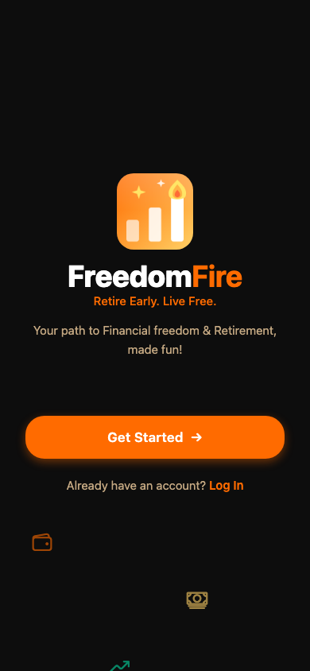
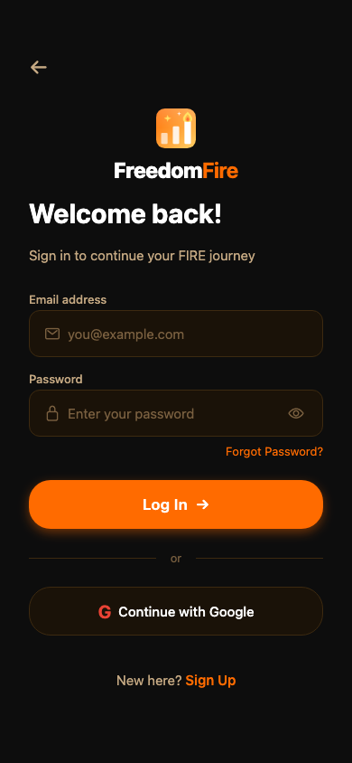
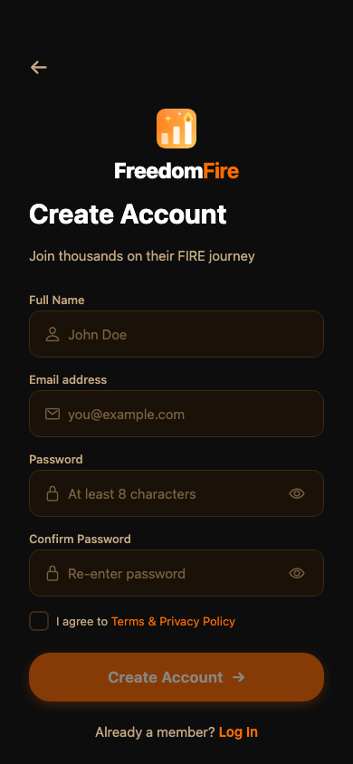
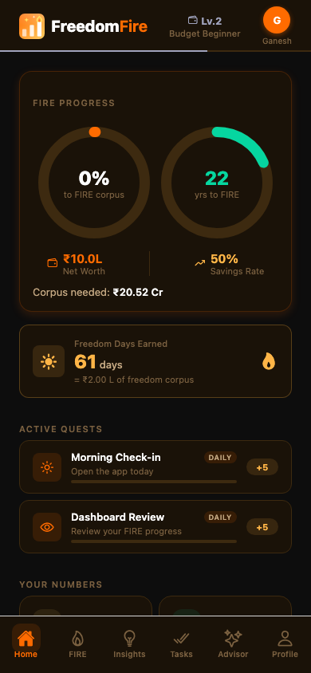
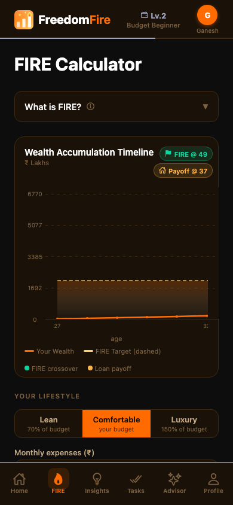
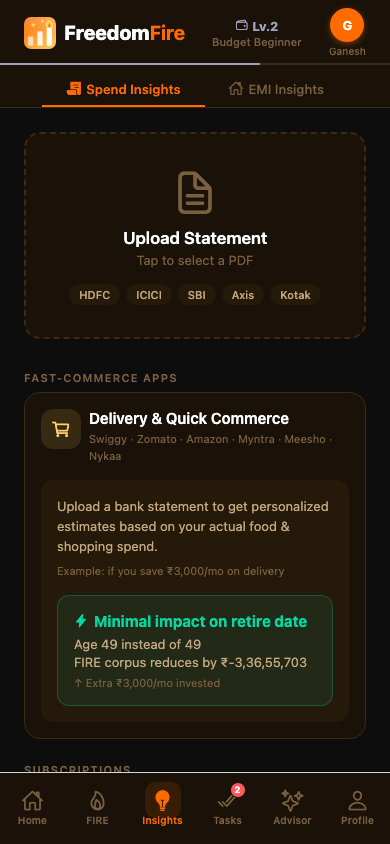
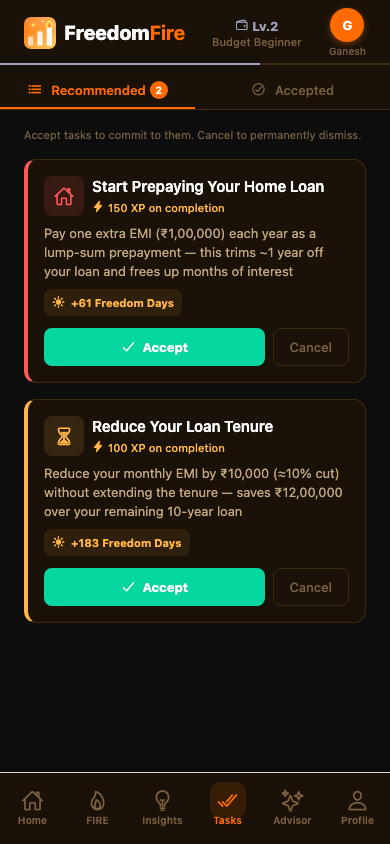
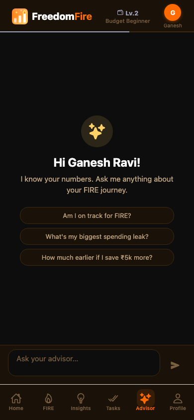
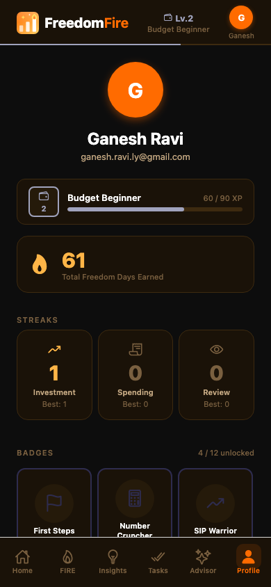

# FreedomFire — App Demo

> Screenshots captured via Playwright on the web build (390×844 mobile viewport).

---

## Onboarding

### Splash Screen

Animated welcome screen with floating finance icons. Clear tagline and two entry points: **Get Started** (new user onboarding) and **Log In**.

---

## Authentication

### Login

Email + password sign-in with Google OAuth option. Form-level Zod validation before any network call.

### Sign Up

Full-name, email, password (8-char minimum), confirm password, and Terms checkbox. Account creation triggers a Supabase confirmation email.

---

## Dashboard

### Home

The main dashboard. Shows:
- **Level badge** (Lv.1 Budget Beginner) and avatar in the top bar
- **Calculate Your FIRE Number** CTA until the user completes the calculator
- **Freedom Days** counter — days of financial freedom earned through good habits
- **Active Quests** — gamified daily challenges (Morning Check-in, Dashboard Review) with XP rewards
- **Get Started** prompt to upload a bank statement

Once the FIRE calculator is filled, this screen renders dual progress rings (corpus % and years to FIRE), a metrics grid, and a milestone bar.

---

## FIRE Calculator

### Calculator

Multi-section form to compute the user's FIRE number:
- **Lifestyle picker** — Lean / Comfortable / Luxury (adjusts the corpus multiplier)
- Monthly expenses, target retirement age
- Monthly income (self + spouse)
- Current savings, investments, and EMI details

Results are stored in Supabase and power the home dashboard.

---

## Spend Insights

### Insights

Two-tab view: **Spend Insights** and **EMI Insights**.

- Upload a PDF bank statement from HDFC, ICICI, SBI, Axis, or Kotak
- AI parses the statement and populates spending categories
- Pre-upload, the screen shows contextual tips by category — Fast-commerce, Subscriptions, etc. — with actionable suggestions like "Cancel 1–2 subscriptions"

---

## Tasks

### AI-Recommended Tasks

Two tabs: **Recommended** and **Accepted**.

Tasks are seeded by the AI advisor after analysing the user's spending and FIRE data. Empty state shown here; once a statement is uploaded and the FIRE calculator is completed, the AI generates personalised financial tasks.

---

## AI Advisor

### Advisor Chat

Personalised AI chat — greets the user by name and knows their FIRE numbers. Suggested prompts:
- *Am I on track for FIRE?*
- *What's my biggest spending leak?*
- *How much earlier if I save ₹5k more?*

Free-text input at the bottom for any finance question.

---

## Profile & Gamification

### Profile

User card with:
- **XP progress bar** — 5/120 XP toward Level 2
- **Freedom Days** total
- **Streaks** — Investment, Spending, and Review streaks with personal bests
- **Badges** — 0/12 unlocked; locked badge previews shown (First Steps, Number Cruncher, Spend Detective, …)

Badges and XP are earned by completing tasks, quests, and daily check-ins.
